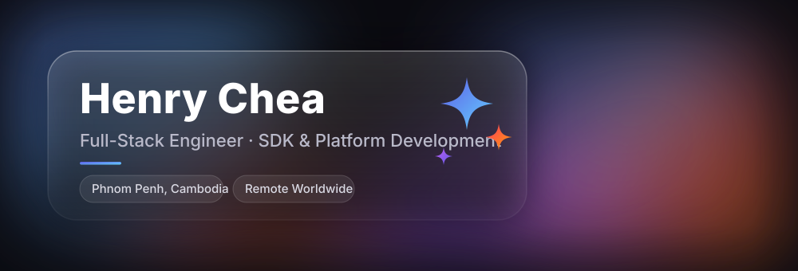

  

I build SaaS products end to end: API, database, web app, mobile app, and docs. One backend, two clients, shipped solo.

## Currently Building: [OKPaid](https://okpaid.io)

A merchant POS and business-management platform, built solo from zero:

- **Backend:** TypeScript, Hono.js, Drizzle ORM, Postgres on Neon, deployed on Cloudflare. RBAC, API-key management, full migration suite.
- **Web:** SolidJS PWA with barcode scanning and product auto-fill from the OpenFoodFacts API.
- **Mobile:** Expo React Native app mirroring the web feature set with mobile-specific UX.
- **Docs:** Astro.js documentation site.
- **Features:** orders, invoices, products, customers, sales, kiosk-mode POS, team roles, API access.

Two full clients in different frameworks on one backend is the core challenge I enjoy: contract-first API design, then build the same product twice with different UI paradigms.

## What I Do

- **Full-stack ownership.** Co-founded SpeakTe (EdTech, zero to product), then shipped across LegalTech, HealthTech, Identity Verification, and Web3. Every role meant learning something new and delivering anyway.
- **Developer experience.** At IDVerse I built and maintained multi-language SDKs (Node.js, JavaScript, Rust, Leptos) plus shared component libraries and SDK tooling used across teams.
- **Payments and verification plumbing.** Stripe billing, DocuSign signing flows, Sumsub KYC, Ethereum wallet payments and smart contracts at GVRN.ai.
- **Leadership.** Mentored two junior frontend developers at Tab Next Asia; led system architecture, financial planning, and investor pitches as SpeakTe co-founder.

## Tech Stack

**Languages**

**Frontend & Mobile**

**Backend & Infrastructure**

**Web3 & Integrations**

**Tools**

## Selected Projects

| Project | Stack | What it is |
|---------|-------|------------|
| [**OKPaid**](https://okpaid.io) | Hono, Drizzle, Postgres, SolidJS, Expo, Astro | Merchant POS and business-management platform, built solo end to end |
| **Gling.ai** | Electron, Solid.js | Desktop video app: timeline scrubbing, automated subtitle generation with high-precision timestamping |
| **Lawato** | Full-stack SaaS | Legal CRM and practice management: case tracking, time logging, billing, dynamic PDF invoices |
| **SpeakTe** | EdTech platform | Co-founded; English-speaking skills platform, Chrome extension for training analytics, raised funds through investor pitches |

## Experience

| Duration | Role | Company | Stack highlights |
|--------|------|---------|------------------|
| <1 yr | Solo Full-Stack Developer | [OKPaid](https://okpaid.io), Remote | Hono, Drizzle, Postgres, SolidJS, Expo |
| ~2 yrs | Frontend Engineer | IDVerse, Remote | SDKs in Node.js, JavaScript, Rust, Leptos; Tailwind dashboards; component libraries |
| ~3 yrs | Full Stack Developer | GVRN.ai, Remote | NestJS, Redis, BullMQ, AWS, Stripe, DocuSign, Sumsub, Ethereum |
| ~1 yr | Frontend Developer | Tab Next Asia, Remote | Vue.js, .NET Web SDK, mentored 2 juniors |
| ~2 yrs | Team & Tech Lead, Co-Founder | SpeakTe, Phnom Penh | System architecture, Chrome extension, fundraising |

**BSc in Information Communications Technology**, University of Puthisastra, Phnom Penh (2017-2021), GPA 3.6/4.0

## GitHub Stats

  

  
  

<!-- The classic github-readme-stats cards are paused right now (DEPLOYMENT_PAUSED, verified 2026-08-10).
     Once they are back, swap them in if you prefer:
  
  
-->

## Get in Touch

- **Email:** [henrychea@outlook.com](mailto:henrychea@outlook.com)
- **LinkedIn:** [linkedin.com/in/cheahenry](https://www.linkedin.com/in/cheahenry)
- **Website:** [henrychea.com](https://www.henrychea.com)

Open to remote full-stack and frontend roles, and to on-site or hybrid work in Phnom Penh. I work best where I own features end to end.

  <em>Languages: English (native), Khmer (native)</em>

